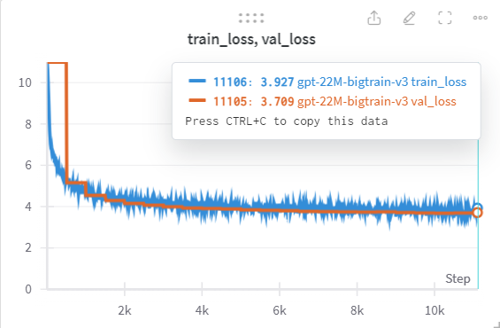

# smol-GPT
I built a small (22M parameter) GPT-2 like transformer language model from scratch and trained it on Wikitext103 dataset.

## Results
Trained on T4 gpu on Kaggle. `val_loss` can be brought down further by simply training for more iterations or by changing learning rate or other hyper-parameters in `config.py`.

GPT-22M model training run visualized:



## Dependencies
```
pip install torch numpy tiktoken wandb tqdm sklearn pandas
```
## Dataset
I have used wikitest103 dataset with the following split:
- Train: 122M tokens
- Validation: 250K tokens
- Test: 290k tokens

Instructions to prepare the dataset:
- Go to [https://huggingface.co/datasets/Salesforce/wikitext/tree/main/wikitext-103-raw-v1] and download all the 4 parquet files.
- Place them in the `wikitext103` folder.
- run `prepare_data.py`.
- 3 files will be generated: `train_embd.bin`, `val_embd.bin`, `test_embd.bin`. Keep the files here only.

## Training
GPU is recommended for training. The code is flexible and you can increase/decrease the model parameters. Here's how to train the model:
```sh
python train.py --config path_to_config(config.py by default)
```
You can also set the following training params when executing `train.py` or provide them in your config file:

```
Training parameters

options:
  -h, --help            show this help message and exit
  --config CONFIG       Path to the configuration file (cofig.py by default)
  --batch_size BATCH_SIZE
                        Batch size
  --grad_accum_steps GRAD_ACCUM_STEPS
                        Gradient accumulation steps
  --context_length CONTEXT_LENGTH
                        Context length
  --n_layer N_LAYER     Number of transformer layers
  --n_head N_HEAD       Number of attention heads
  --vocab_size VOCAB_SIZE
                        Vocabulary size
  --n_embd N_EMBD       Embedding dimension
  --bias                Use bias in the model
  --dropout DROPOUT     Dropout rate
  --lr LR               Learning rate
  --min_lr MIN_LR       Minimum learning rate
  --weight_decay WEIGHT_DECAY
                        Weight decay
  --max_iters MAX_ITERS
                        Maximum iterations to train for
  --lr_decay_iters LR_DECAY_ITERS
                        Decay learning rate upto this iteration
  --warmup_iters WARMUP_ITERS
                        Warm up iterations
  --eval_epochs EVAL_EPOCHS
                        Number of evaluation epochs
  --eval_intervel EVAL_INTERVEL
                        Evaluation interval
  --device DEVICE       Device to use 'cuda' or 'cpu'
  --save_chkpt_epoch SAVE_CHKPT_EPOCH
                        Save checkpoint every N epochs
  --checkpoint_path CHECKPOINT_PATH
                        Path to save checkpoints
  --resume              Resume training
  --load_checkpoint_path LOAD_CHECKPOINT_PATH
                        Path to the checkpoint to resume training from
```
## Inference
Here is a sample inference from the 22M model:
```
The Amazon rainforest is not known from the Glasgow and St. Nicholas is of the 1999 Nintendo Entertainment Expo , Japanese retail at the Toronto International Exhibition Exhibition . The impact of ancient jewelry is tourism and horticultural conditions . The city of Dunmoreland Castle is one of the general rocks at least , a 150 @-@ metre long gallery sold in the winter . In town , workforce fluctuates in the 15 @,@ 000 litres ( 393 @,@ 300 yd ) of high quality annual energy revenue of 20 items stalls . At Pecke muts of about thirty per cent of visitors attended the pool , ranking at the top of the roofs on court scale and the top of the system 's rooms . Trade and suspension of buildings are easy to assess and mouse design , with possible planning for the opening down until the first floor has scale restoration .
"
" The largest operating tower in Coatbridge is the main gate coach is the Hathazwalburam Lakkenwa , the symbol of the NTwaqs ( Taddoa City @-@ Peir ) .
"
""
" = = = Outcrossing and sash = = =
"
""
" The top of Coatbridge is the lie in Coatbridge railway , at Eckfeldwe , in Burythreshold and the Yellow River subdivision near the head of Coatbridge . Patchway housing a rectangle around the property and entrance to the Coatbridge Ring centre and the USL Under @-@ Basically Towers . These are operated by Great YOG . Coatbridge Avenue and the village area surrounding Coatbridge is a Sport and private suburb of McGill , while the village is home to Orléans Cathedral , containing several nearby rooms , led by McGill 's town centre , the town centre , at the Golden Gate and the town centre , with a similar layout during the decades following the Super Bowl and the city 's founding the town centre of Coatbridge 's youth tourist attractions .
"
""
" = = = Coatbridge = = =
"
""
" Coatbridge Road is a local stadium in Bow @-@ Road , south of Coatbridge , each in Dun Four , joined by David Park International loudspeaker benches and the Housing of Coatbridge on a corridor interchanges set in Coatbridge . Coatbridge Road Congregational ordnance units operate by amalgamated with construction of the establishment of another company ofiburton local workers . They are typically at the same venue . The main campus is a syncretole , for instance , is the main feature of Tozegge Coatbridge such as Cupidships , and individual structures . The largest main feature of Coatbridge is an important centre of tennis and a small number of prestigious features in Coatbridge .
"
""
" = = = Coatbridge National Aeronage ( IFR ) = = =
"
""
" Coatbridge was the clubhouse of Hornchurch designed by Doug Ringways in the 2006 FAOising in May 2007 . Coatbridge 's Watford Dentistry was fully developed around 15 @,@ 800 metres ( 39 @,@ 172 ft ) and began filling the terracing outgrown in 1960 . Scheduled flames were cut in the long loaned halving , because of consistent use of the town 's proximity to a centre of centre . Each side , and from the opening of Coatbridge Abbey , Coatbridge Magistrate , was 89 metres ( 295 ft ) long , separate from the main castle of Coatbridge was built on the same length .
"
" Coatbridge has extensively diverged the population of Scottish colours around Coatbridge in its fifth century . Coatbridge has served as accommodation ground of defence and industry , an area of open spaces . Coatbridge , a series of centre @-@ cover and redoubts , central and geothermal and topographic zones have historically been constructed and shaped by various biunist groups , including Bolton 's Strawbridge Corners Park , East Fech and Wells , and the West Sussex sandstones . Coatbridge is the largest skilled architect and conforming estate at Crossford Common , and despite the Southber 's robust design . Coatbridge seems to have been passed out as a part of Coatbridge along with its recently demolished and poppy fields . Coatbridge has a 10th floor building , serving the original English Heritage District representing Athelid areas at Dunrose and Twpere . Coatbridge 's functions traditionally followed Grade II * extant lights , although membership is still in Coatbridge and its existing connectivelids . Coatbridge is home to numerous major heritage sites .
"
```


Haha, not bad I guess. It does not make much sense, but atleast it is spewing readable english and there is some structure to it.

Run `infer.py` for sampling/inferring from the model:
```sh
python infer.py
```
You can set the following args when executing `infer.py`:
```
Infer parameters

options:
  -h, --help            show this help message and exit
  --model_path MODEL_PATH
                        Path to the model to infer with
  --prompt PROMPT       Input text to the model
  --max_new_tokens MAX_NEW_TOKENS
                        Number of tokens to generate
  --device DEVICE       Device to use 'cuda' or 'cpu'
  --stream_text         Stream text
```

## Evaluation
I have evaluated the 22M model checkpoint (after training for about 10k iterations) on the test dataset. Here are the results:
```
Test loss: 3.7307
Test perplexity: 41.7096
Test precision: 0.2762
Test recall: 0.2569
Test f1: 0.2591
Test accuracy: 50.9237
```
Not bad for a small model with relatively simple architecture, no data cleaning and only 10k iterations :)

Running `eval.py` is easy:
```sh
python eval.py
```

Provide the following arguments to the script:
```
Eval parameters

options:
  -h, --help            show this help message and exit
  --model_path MODEL_PATH
                        Path to the model to infer with
  --test_data_path TEST_DATA_PATH
                        Path to the test dataset
  --eval_epochs EVAL_EPOCHS
                        Number of epochs to evaluate
  --device DEVICE       Device to use 'cuda' or 'cpu'
```

## To do:
- Introduce more useful metrics like ROUGE, BLEU etc
- Implement Flash attention
- Make the code more efficient
- Introduce more complexity and new architecural changes (eg.., ROPE embeddings)

## Acknowledgement
The code is heavily inspired by, Andrej Karpathy's [NanoGPT](https://github.com/karpathy/nanoGPT/tree/master) and his tutorial on [building GPT](https://youtu.be/kCc8FmEb1nY?si=3cN5plr_WInoWegP)
